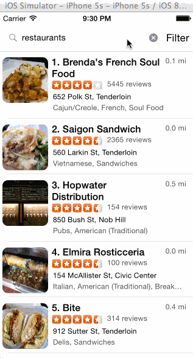

## CodePath Week 2: Yelp Search

This is a Yelp Search client written in Swift that uses the [Yelp Search API](http://www.yelp.com/developers/documentation/v2/search_api). Assignment finally complete.

**Time spent**: Approximately 25 hours total

### Issues

* Distance sort doesn't seem to work. Think this may be on Yelp side but no time to dig further.

### Walkthrough



### Requirements

Only search results of the requirements was completed.

  * [x] Search results page
    * [x] Table rows should be dynamic height according to the content height
    * [x] Custom cells should have the proper Auto Layout constraints
    * [x] Search bar should be in the navigation bar (doesn't have to expand to show location like the real Yelp app does).
    * [ ] Optional: infinite scroll for restaurant results
    * [ ] Optional: Implement map view of restaurant results
  * [x] Filter page. Unfortunately, not all the filters are supported in the Yelp API.
    * [x] The filters you should actually have are: category, sort (best match, distance, highest rated), radius (meters), deals (on/off).
    * [x] The filters table should be organized into sections as in the mock.
    * [x] You can use the default UISwitch for on/off states. Optional: implement a custom switch
    * [x] Radius filter should expand as in the real Yelp app
    * [x] Categories should show a subset of the full list with a "See All" row to expand.
    * [x] Clicking on the "Search" button should dismiss the filters page and trigger the search w/ the new filter settings.
  * [ ] Optional: Implement the restaurant detail page.

### Installation

Run the following in command-line:

```
pod install
open Yelp.xcworkspace
```

In XCode 6, run the app using the `iPhone 5S` simulator.

### Resources

The following CocoaPods were used:

  * [AFNetworking](https://github.com/AFNetworking/AFNetworking)
  * [BDBOAuth1Manager](https://github.com/bdbergeron/BDBOAuth1Manager)
  * [SVPullToRefresh](https://github.com/samvermette/SVPullToRefresh)

### License

> The MIT License (MIT)
>
> Copyright © 2014 Wanda Cheung
>
> Permission is hereby granted, free of charge, to any person obtaining a copy of
> this software and associated documentation files (the “Software”), to deal in
> the Software without restriction, including without limitation the rights to
> use, copy, modify, merge, publish, distribute, sublicense, and/or sell copies of
> the Software, and to permit persons to whom the Software is furnished to do so,
> subject to the following conditions:
>
> The above copyright notice and this permission notice shall be included in all
> copies or substantial portions of the Software.
>
> THE SOFTWARE IS PROVIDED “AS IS”, WITHOUT WARRANTY OF ANY KIND, EXPRESS OR
> IMPLIED, INCLUDING BUT NOT LIMITED TO THE WARRANTIES OF MERCHANTABILITY, FITNESS
> FOR A PARTICULAR PURPOSE AND NONINFRINGEMENT. IN NO EVENT SHALL THE AUTHORS OR
> COPYRIGHT HOLDERS BE LIABLE FOR ANY CLAIM, DAMAGES OR OTHER LIABILITY, WHETHER
> IN AN ACTION OF CONTRACT, TORT OR OTHERWISE, ARISING FROM, OUT OF OR IN
> CONNECTION WITH THE SOFTWARE OR THE USE OR OTHER DEALINGS IN THE SOFTWARE.
